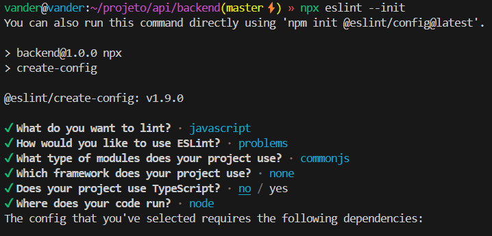
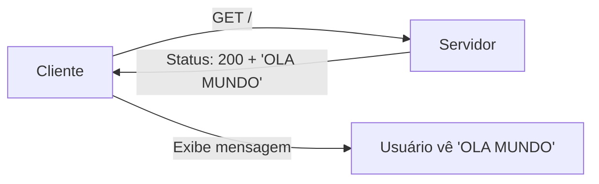

# ESTUDO API  

📌 **Descrição**: Aula sobre API - express. 


## 🚀 Funcionalidades  
- Item 1  
- Item 2  

## 📋 Pré-requisitos  
- Node.js  
- Git  

## 🔧 Instalação  
```bash
echo("iniciar a aplicacao")
mkdir backend && cd backend
npm init -y  
echo("dependencias")  
npm install express
npm install mysql2
echo("Com a flag -d para desenvolvimento")
npm install nodemon -D
npm install dotenv
npx eslint --init
mkdir src  


```
Configurações do eslint



📌 **Comentários**: arquivos e outros. 
```JSON
"scripts": {
    "test": "echo \"Error: no test specified\" && exit 1",
    "start": "node src/index.js"
    
  }

```
Inserir o script start

```bash
npm start
```
```js
const express = require('express');
const app =express();
app.listen(3300, () => console.log('SERVER --- run ---- port 3300'));
// sem rota para /
```
RODAR O SERVER NA PORTA 3300

Inserindo uma ROTA /
```js
app.get('/task',(request,response)=>response.status(200).send('OLA MUNDO'));
```

Executando em mode desenvolvimento NODEMON


```JSON
"scripts": {
    "test": "echo \"Error: no test specified\" && exit 1",
    "start": "node src/index.js",
    "dev": "nodemon src/index.js"
    
  }

```
TERMINAL - mode dev para script nodemon
```bash
npm run dev

curl -I http://localhost:3300
```
TESTANDO   curl -I http://localhost:3000




